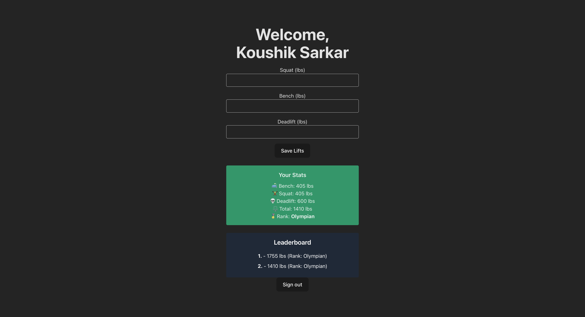

# LiftLogix
LiftLogix is a personal strength tracker and leaderboard web app built with React + Firebase. Users can log Squat, Bench, and Deadlift (SBD) lifts, track progress over time, and see how they rank against others.

## **Features**
-Firebase Auth: Secure Google Sign-In

-Progress Chart: Visualize your lift progress over time

-Leaderboard: See where you rank by SBD total

-Lift Logging Form: Submit and update your lifts easily

-User Profiles: Edit display name and personal info

-Responsive UI: Clean, mobile-friendly design with Tailwind CSS

## **Tech Stack**
-Frontend: React (Vite), Tailwind CSS, React Router

-Auth & DB: Firebase Auth, Firestore

Hosting: Vercel

Still a work in progress

# Preview
 

**Most stats above is inaccurate 

## To Do (Feature Map)
-Ranking Tier
-UI/UX + Mobile 
- +Security
- Options for image uploads 

### To Run
npm i 

npm run dev 

